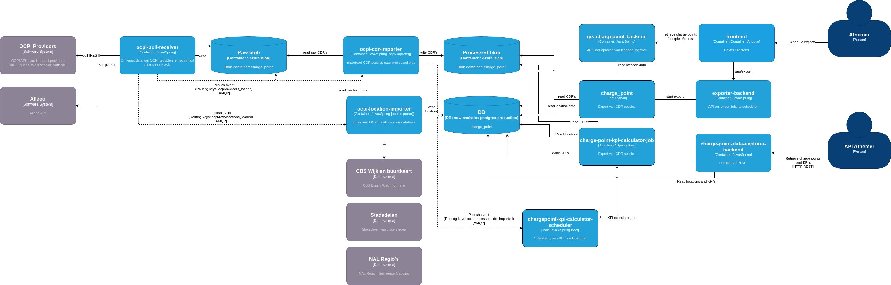

### Architectuur

### Data ontvangst

Het LINDA Dataportaal maakt gebruik van OCPI (Open Charge Point Interface) voor de uitwisseling van locatie en sessiegegevens van openbare laadpalen. Het LINDA Dataportaal ondersteunt OCPI-versie 2.1.1 en 2.2.1.

Binnen de OCPI-keten is een pull interface verplicht en push is optioneel. Bij de implementatie van het LINDA Dataportaal is gekozen om de informatie via een pull-receiver op te halen.

De frequentie waarmee CDR data opgehaald wordt is xx keer per uur. Locatiegegevens worden elke nacht opgehaald.

### Data verwerking
 
Na ontvangst van de data van CPO's worden de data opgeslagen op een Azure blob storage omgeving bij NDW. Tijdens de verwerking door NDW worden een aantal verrijkingen en validatie regels toegepast. Zo worden de wijk- en buurtkaart van het CBS gebruikt om locaties van laadaplen te verrijken met extra informatie zoals de gemeente-, wijk- en buurtnaam. Ook worden de locaties van laadpalen gemapt op de S00xS00 CBS rastercellen.

CDR data
De CDR data worden bij het verwerken gecontroleerd op de onderstaande regels:

- check op aanwezigheid van verplichte velden in de OCPI specs.
    - Alleen de velden die worden geïmporteerd worden gecontroleerd
    - [versie 2.1.1](https:\\github.com/ocPi/ocpi/releases/download/2.1.1-d2/OCPI-2.1.1-d2.Pdf) 
    - [versie 2.2.1](https:\\github.com/ocPi/ocpi/releases/download/2.2.1/OCPl-2.2.1.Pdf)
- total_energy negatief
- start datetime in de toekomst
- end datetime in de toekomst
- start datetime in het verleden (alles voor 2009)
- end datetime in het verleden (alles voor 2009)
- start datetime groter dan end datetime
- start datetime gelijk aan end datetime
- total_time negatief
- total_time komt niet overeen met verschil tussen start en end datetime

KPI data
Voor de onderstaande KPI's wordt maandelijks data berekend.

tbd
